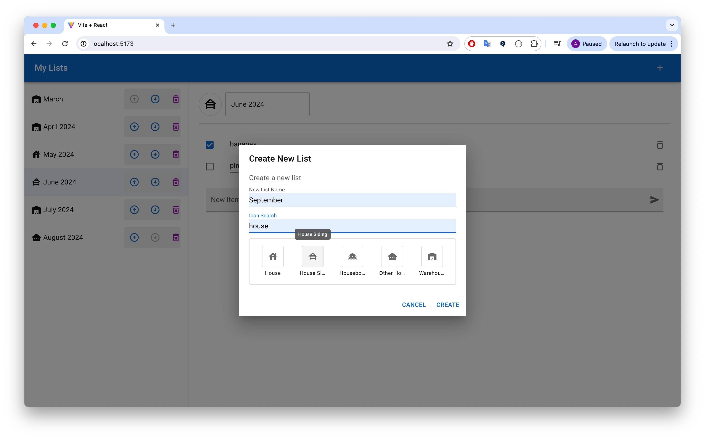
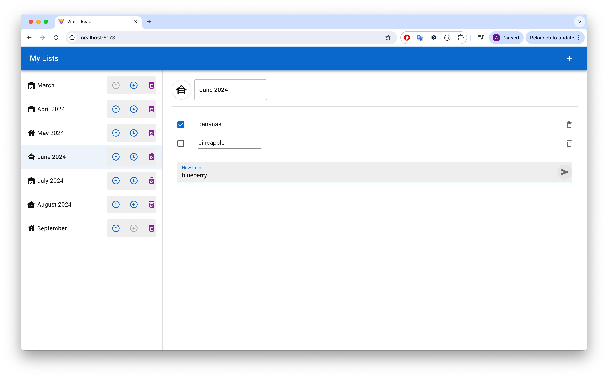
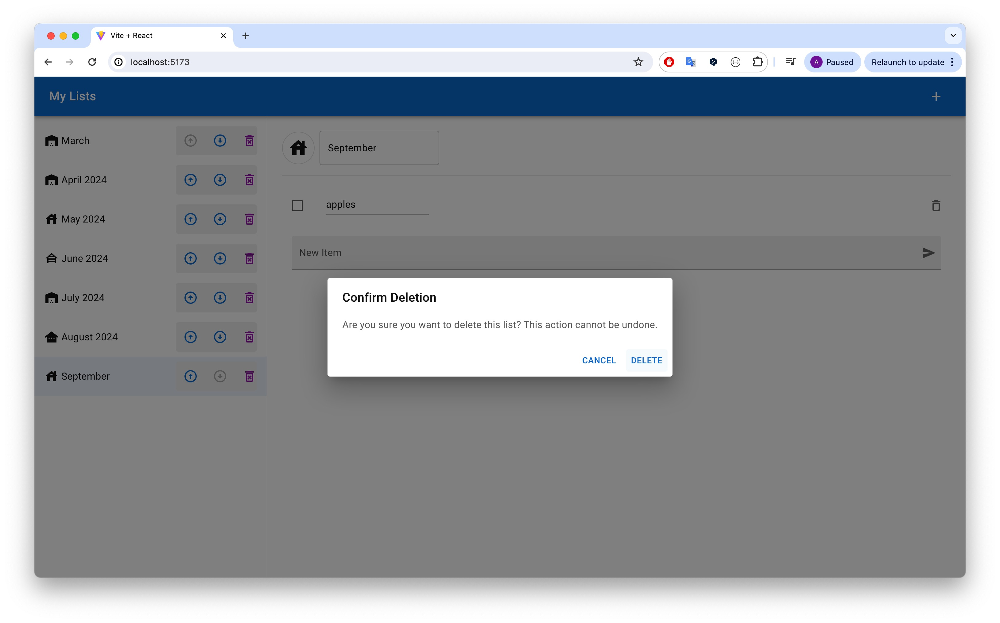
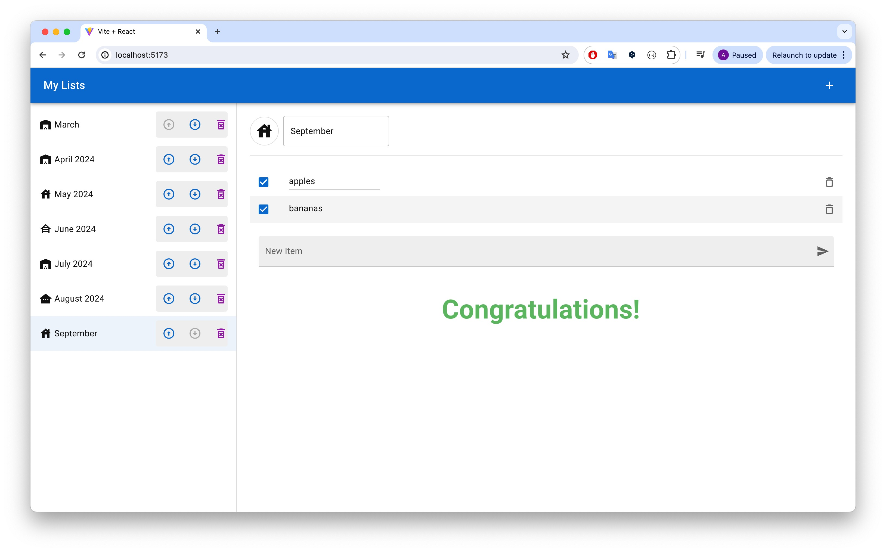

# My Simple Todo List

This Todo List application is a modern web app built using React with Vite as a build tool, allowing for a fast development environment. It uses Material-UI for component styling and Dexie.js as a wrapper for IndexedDB to provide a robust solution for managing tasks with persistence.

## Features

- **Create Todo Lists**: Users can create multiple todo lists, each with custom icons and names.
- **Manage Todo Items**: Add, edit, and delete tasks within each list.
- **Sort Todo Lists**: Users can sort the order of their todo lists.
- **Congratulations Animation**: Get a congratulatory animation when all items in a list are checked.
- **Responsive Design**: Ensures the app is usable on both desktop and mobile devices.

## Technologies Used

- **React**: A JavaScript library for building user interfaces.
- **Vite**: A modern frontend build tool that significantly improves the development experience.
- **Material-UI**: A popular React UI framework for designing beautiful interfaces.
- **Dexie.js**: Simplifies IndexedDB use with a minimal API.
- **SWR**: A React Hooks library for data fetching.

## Prerequisites

Before you begin, ensure you have met the following requirements:

- Node.js installed on your machine
- NPM or YARN installed for managing packages

## Setup and Installation

To get this project up and running on your local machine for development and testing purposes, follow these simple example steps.

1. **Clone the Repository**

   ```bash
   git clone https://github.com/AtsukoKuwahara/my_simple_todos.git
   cd my_simple_todos
   ```

2. **Install Dependencies**

   ```bash
   npm install
   ```

3. **Run the Application**

   ```bash
   npm run dev
   ```

   This will run the app in development mode on [http://localhost:5173](http://localhost:5173). Open this URL in your browser to view the app.
   
## Usage

Once the application is running, you can access it through your browser at http://localhost:5173/. From there, you can:

- Click the "+ (Add)" button to create a new list or add new items to an existing list.
  
*Figure 1: Adding a new list to My Lists*

- Edit items or use the icon next to each item to delete as needed.
  
*Figure 2: Adding a new item to the list*

- Use the up and down arrows to sort the order of your lists.
- Use the icons next to each list to delete as needed.
  
*Figure 3: Deleting a selected list from My Lists*

- Check all items in a list to see a congratulations animation.
  
*Figure 4: Congratulations animation displayed when all items are checked*

## Project Structure

- `src/components`: React components for user interface.
- `src/hooks`: Custom hooks for managing state and interacting with IndexedDB.
- `src/providers`: React context providers for global state management.
- `src/utils`: Utilities and helper functions, including database setup.

## Credits

This project was initially based on a project from a Udemy course, which was then customized and extended with additional features and improvements.

## License

This project is open source and available under the [MIT License](LICENSE).
